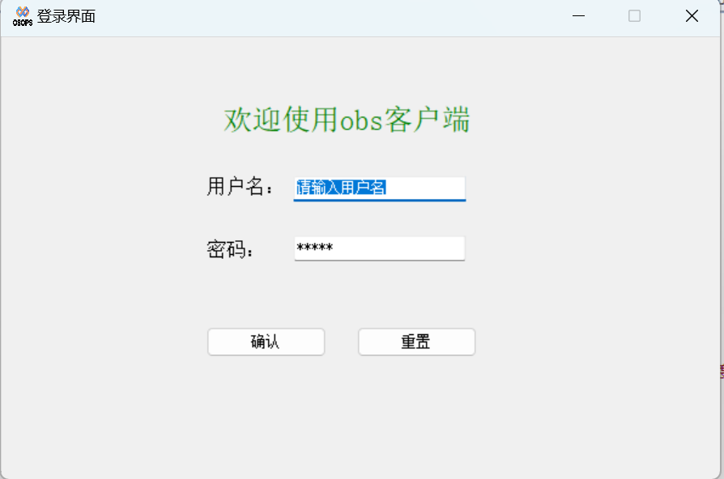
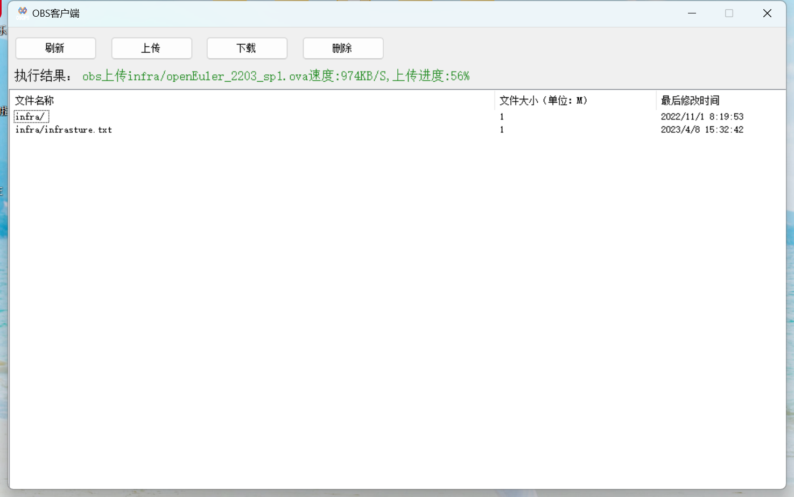
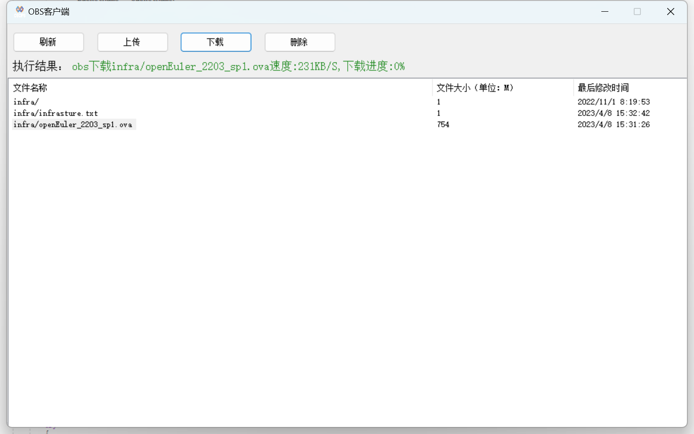
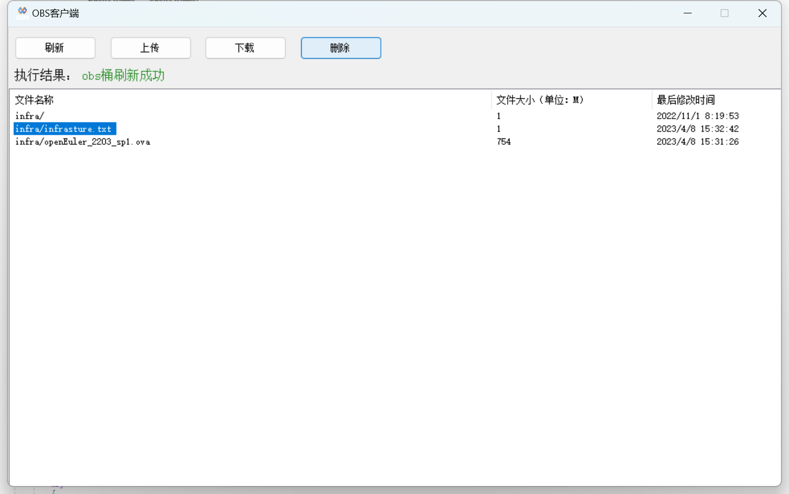

# README

## 背景

华为云提供OBS对象系统，可以上传下载文件，而在使用中发现一系列问题？

1.每个用户使用一个桶进行文件存储，多个用户使用多个桶？ 不好意思，我是个穷逼。

2.一个桶给多个用户使用，对象桶的权限与IAM用户进行绑定，同一个桶给不同的用户使用，需要创建多个IAM用户， 整个流程，十分繁琐，详细参考： https://github.com/Open-Infra-Ops/obs-interact， 目前，这个仓库就是利用这种方法进行处理的。我感觉十分的繁琐，操作起来直喊老命，没有一丢丢办法，作为程序员的我，必须想去解决它？

思考:  如何解决它？ 

华为云提供obs对象系统的sdk， 首先想到的是不能通过后端进行中转上传，这无疑于脱了裤子放屁，多此一举，那就必须从前端想法， 关于前端的技术栈只有nodejs,  browserjs,  这些技术都太高大上，脑壳痛。此时我翻了翻压在床底的c#从入门到放弃，满是灰层，我想了想，小伙子，你在给我灵感吗？好吧，就是你了。

## 实现

基于华为云提供的.NET的SDK，使用winform技术， 使用c#打造超级厉害的，遥遥领先的桌面级程序

流程简介：本程序无需安装，打开即用

下载--->配置--->登录--->文件的增删查改

## 流程

1.下载，将release文件中的压缩包解压。

2.配置文件

~~~bash
<?xml version="1.0" encoding="utf-8" ?>
<ObsClient>
	<Ak>***</Ak>  # 华为云的AK
	<Sk>***</Sk>  # 华为云的SK
	<Url>https://obs.cn-north-4.myhuaweicloud.com</Url>  # 华为云的URL
	<Path>infra/</Path>          # 桶下的具体路径，每个用户的路径都不一致
	<BucketName>***</BucketName> # 桶名
</ObsClient>
~~~

3.运行程序，登录， 用户名和密码都是admin

+ 后续配置文件和登录会继续优化，接入oauth2.0和后台站点管理用户信息。

4.文件的增删查改

用户上传文件:  点击上传按钮，选择待上传的文件，点击确认，即可开始上传，上传进度会在执行结果中显示。

用户下载：点击下载按钮，选择放置文件的路径，点击确认，即可开始下载，下载进度会在执行结果中显示。

删除文件：选择要删除的文件，点击删除按钮，即可完成删除。

